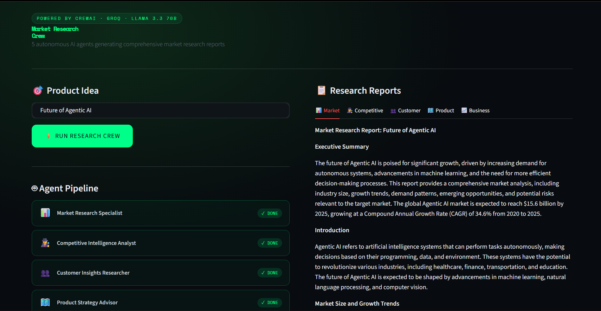
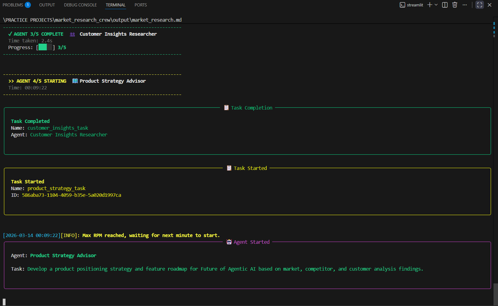

# 🧠 Market Research Crew

> Five specialized AI agents collaborating to generate comprehensive market research reports — powered by **CrewAI** × **Groq LLaMA 3.3 70B**, with a **Streamlit UI** and live terminal monitoring.

---

## ✨ What It Does

Enter any product idea and get five fully-written research reports in minutes:

| # | Agent | Output |
|---|-------|--------|
| 1 | 📊 Market Research Specialist | Industry size, trends & opportunities |
| 2 | 🕵️ Competitive Intelligence Analyst | Competitors, pricing & market share |
| 3 | 👥 Customer Insights Researcher | Personas, pain points & needs |
| 4 | 🗺️ Product Strategy Advisor | Positioning strategy & feature roadmap |
| 5 | 📈 Business Analyst | Actionable recommendations |

Each agent builds on the previous one's output, producing a cohesive end-to-end research report.

---

## 🖥️ Screenshots



<br/>



---

## 🛠️ Tech Stack

| Layer | Technology |
|-------|-----------|
| Agent Framework | [CrewAI](https://crewai.com) |
| LLM | Groq — `llama-3.3-70b-versatile` (free tier) |
| Frontend | Streamlit |
| Language | Python 3.13 |
| Package Manager | uv / pip |

---

## 📦 Dependencies

```txt
crewai
crewai-tools
streamlit
python-dotenv
pyyaml
requests
groq
```

---

## ⚙️ Setup

**1. Clone the repo**
```bash
git clone https://github.com/syed-kaif07/market-research-crew.git
cd market-research-crew
```

**2. Install dependencies**

Using `pip`:
```bash
pip install -r requirements.txt
```

Or using `uv`:
```bash
pip install uv
uv sync --prerelease=allow
```

> `--prerelease=allow` is required when using uv — `crewai[litellm]` depends on pre-release packages.

**3. Set up environment variables**

Create a `.env` file in the root:
```env
MODEL=groq/llama-3.3-70b-versatile
GROQ_API_KEY=your_groq_api_key_here
```

Get a free Groq API key at [console.groq.com](https://console.groq.com) — no credit card required.

**4. Run the Streamlit UI**
```bash
python -m streamlit run src/market_research_crew/streamlit_app.py
```

**Or run directly from terminal**
```bash
python src/market_research_crew/main.py --product-idea "your idea here"
```

---

## 🏗️ Architecture

```
User (Streamlit UI)
       │
       ▼
streamlit_app.py  ──────────────────────────────────────►  Browser UI
       │                                                  (agent cards + report tabs)
       │  subprocess.Popen(stdout=None)
       ▼
main.py  ──►  CrewAI  ──►  Agent 1  ──►  Agent 2  ──►  ...  ──►  Agent 5
                  │
                  └──  task_callback  ──►  Live colored output in IDE terminal
                  │
                  ▼
            output/*.md  (polled by Streamlit every 4s)
```

The UI and terminal update **simultaneously** — Streamlit tracks agent progress visually while the terminal streams verbose CrewAI output in real time.

---

## 🖥️ Live Terminal Output

```
=================================================================
        MARKET RESEARCH CREW - AGENT PIPELINE
        Powered by CrewAI x Groq x LLaMA 3.3 70B
=================================================================

  Research Topic: future of Gen AI in health sector

  1. 📊  Market Research Specialist        [ QUEUED ]
  2. 🕵️  Competitive Intelligence Analyst  [ QUEUED ]
  3. 👥  Customer Insights Researcher      [ QUEUED ]
  4. 🗺️  Product Strategy Advisor          [ QUEUED ]
  5. 📈  Business Analyst                  [ QUEUED ]

-----------------------------------------------------------------
  >> AGENT 1/5 STARTING  📊  Market Research Specialist
-----------------------------------------------------------------

  ✓ AGENT 1/5 COMPLETE  📊  Market Research Specialist
  Time taken: 43.2s
  Progress: [█░░░░] 1/5
```

---

## 🔧 Configuration

Agents and tasks are defined in YAML:

```
src/market_research_crew/config/
├── agents.yaml   ← roles, goals, backstories
└── tasks.yaml    ← task descriptions, output filenames
```

To swap the LLM or tune parameters, edit `crew.py`:
```python
llm = LLM(
    model=os.environ.get("MODEL"),
    api_key=os.environ.get("GROQ_API_KEY"),
    temperature=0.7,
    max_tokens=2048,
    max_retries=5,
    timeout=120,
)
```

---

## 📌 Notes

- Uses **Groq's free tier** — no credit card required
- Agents run **sequentially**, each building on the last
- Free tier rate limit: **12,000 tokens/minute**

---

## 📝 Full Build Article

Read the full story on Dev.to → [Building a Multi-Agent AI Market Research Tool with CrewAI & Groq](https://dev.to/syed_kaif777/title-building-a-multi-agent-ai-market-research-tool-with-crewai-groq-22na)

---

## 📬 Author

Built by [Syed Kaifuddin](https://github.com/syed-kaif07)
