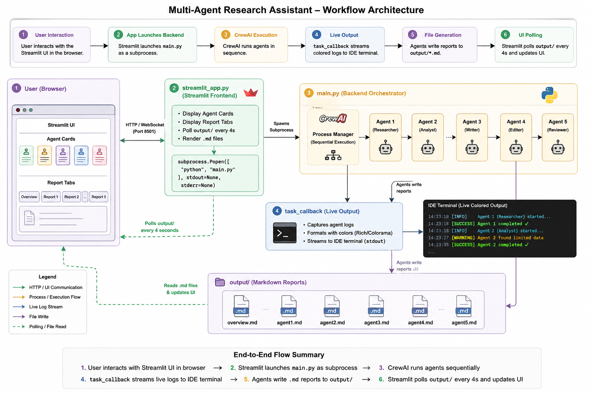

# 🧠 Market Research Crew

> Drop in any product idea. Get five AI-written research reports in minutes.

Five specialized AI agents work sequentially — each one building on the last — to deliver a full market research package. Powered by **CrewAI** + **Groq** with a **Streamlit UI** and live terminal output.


---

## 🤖 What the 5 Agents Do

| # | Agent | What It Produces |
|---|-------|-----------------|
| 1 | 📊 Market Research Specialist | Industry size, trends & growth opportunities |
| 2 | 🕵️ Competitive Intelligence Analyst | Competitor breakdown, pricing & market gaps |
| 3 | 👥 Customer Insights Researcher | User personas, pain points & unmet needs |
| 4 | 🗺️ Product Strategy Advisor | Positioning strategy & feature roadmap |
| 5 | 📈 Business Analyst | Final synthesis with actionable recommendations |

Each report is saved as a `.md` file in `output/` and displayed live in the UI as it's completed.

---

## 🚀 Quick Start

### 1. Clone the repo
```bash
git clone https://github.com/syed-kaif07/market-research-crew.git
cd market-research-crew
```

### 2. Install dependencies

Using `uv` (recommended):
```bash
pip install uv
uv sync
```

Or using `pip`:
```bash
pip install -r requirements.txt
```

### 3. Add your API key

Create a `.env` file in the project root:
```env
MODEL=groq/llama-3.3-70b-versatile
GROQ_API_KEY=your_groq_api_key_here
```

Get a **free** Groq API key (no credit card) at [console.groq.com](https://console.groq.com).

### 4. Run it

**Streamlit UI** (recommended):
```bash
python -m streamlit run src/market_research_crew/streamlit_app.py
```

**Terminal only:**
```bash
python src/market_research_crew/main.py --product-idea "your idea here"
```

---

## 🏗️ Architecture



The Streamlit UI and terminal update **simultaneously** — the UI shows agent progress cards while your terminal streams the full verbose CrewAI output with live colors.

---

## 🖥️ Live Terminal Output

When you run the crew, your terminal shows a live progress view:

```
=================================================================
        MARKET RESEARCH CREW - AGENT PIPELINE
        Powered by CrewAI x Groq x llama-3.3-70b-versatile
=================================================================

  Research Topic: future of Gen AI in health sector

  1. 📊  Market Research Specialist        [ QUEUED ]
  2. 🕵️  Competitive Intelligence Analyst  [ QUEUED ]
  3. 👥  Customer Insights Researcher      [ QUEUED ]
  4. 🗺️  Product Strategy Advisor          [ QUEUED ]
  5. 📈  Business Analyst                  [ QUEUED ]

-----------------------------------------------------------------
  >> AGENT 1/5 STARTING  📊  Market Research Specialist
-----------------------------------------------------------------

  ✓ AGENT 1/5 COMPLETE  📊  Market Research Specialist
  Time taken: 43.2s
  Progress: [█░░░░] 1/5
```

---

## 🛠️ Tech Stack

| Layer | Technology |
|-------|-----------|
| Agent Framework | [CrewAI](https://crewai.com) |
| LLM | Groq — `llama-3.3-70b-versatile` (free tier) |
| Frontend | Streamlit |
| Language | Python 3.12+ |
| Package Manager | uv |

---

## ⚙️ Configuration

Agents and tasks are defined in YAML — easy to edit without touching Python:

```
src/market_research_crew/config/
├── agents.yaml   ← roles, goals, backstories for each agent
└── tasks.yaml    ← task descriptions and output file names
```

To change the model or tune LLM parameters, update `.env` or edit `crew.py`:
```python
llm = LLM(
    model=os.environ.get("MODEL"),      # set in .env
    api_key=os.environ.get("GROQ_API_KEY"),
    temperature=0.7,
    max_tokens=2048,
    max_retries=5,
    timeout=120,
)
```

---

## 📌 Important Notes

- ✅ **Free to run** — Groq's free tier, no credit card required
- 🔁 **Sequential execution** — each agent receives the previous agent's output as context
- ⚡ **Rate limit**: `llama-3.3-70b-versatile` has 12,000 tokens/minute on the free tier
- 🐢 **Expect ~5–10 mins** for a full 5-agent run on the free tier

---

## 📝 Full Build Article

Read the full story on Dev.to → [Building a Multi-Agent AI Market Research Tool with CrewAI & Groq](https://dev.to/syed_kaif777/title-building-a-multi-agent-ai-market-research-tool-with-crewai-groq-22na)

---

## 📬 Author

Built by [Syed Kaifuddin](https://github.com/syed-kaif07)